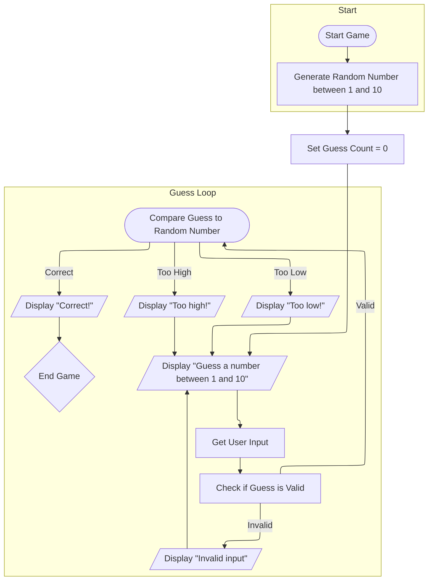

To play this game one would press "Start Game". The game will generate a random number between 1 and 10. 
The user would then be requested to make a guess between 1 and 10. 
The game will check if the input is a valid guess, with parameters of 1 to 10. 
If valid, the game will compare the guess to the randomly generated number. 
If  Correct, it will display "Correct!" and end the game. 
If the input is not within the parameters, the user will be asked to guess again. 
If the guess is within the parameters, but not correct, it will display "Too low" or "Too high" corresponding to the input of the user, and request the user to guess again.
